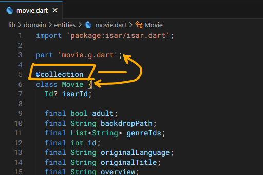

# Cinemapedia

App desarrollada durante el curso de Flutter de Fernando Herrera

# <span style="color: yellow">Desarrollo</span>

1. Copiar el .env.template y renombrarlo a .env

2. Cambiar las variables de entorno (The MovieDB)

3. Cambios en la entidad, hay que ejecutar el comando:

    > flutter pub run build_runner build

# <span style="color: yellow">Base de datos Isar</span>

## Instalación y configuración

1. Instalar las dependencias <span style="color: green">__isar__</span>, <span style="color: green">__isar_flutter_libs__</span> y <span style="color: green">__path_provider__</span>:

    > flutter pub add isar isar_flutter_libs path_provider

2. Instalar las dependencias de desarrollo <span style="color: green">__isar_generator__</span> y <span style="color: green">__build_runner__</span>:

    > flutter pub add -d isar_generator build_runner

    Todas las dependencias de Isar (<span style="color: green">isar</span>, <span style="color: green">isar_flutter_libs</span> e <span style="color: green">isar_generator</span>) deben tener la misma versión.

    https://pub.dev/packages/isar
    
    https://pub.dev/packages/isar_flutter_libs
    
    https://pub.dev/packages/isar_generator

3. Añadir la anotación <span style="color: green">__@collection__</span>: Asocia la clase de la entidad con la clase de base de datos.

    

4. Añadir el identificador único para la base de datos:

    ```
    Id? isarId;
    ```

5. Añadir el part con la nomenclatura <span style="color: green">__nombreClase.g.dart__</span>. Varios ejemplos:

    > Movie > part "movie.g.dart"

    > Cliente > part "cliente.g.dart"

    > Factura > part "factura.g.dart"

    Al añadirlo, se mostrará un error, es normal.

6. Ejecutar el comando generador de base de datos:

    > flutter pub run build_runner build
